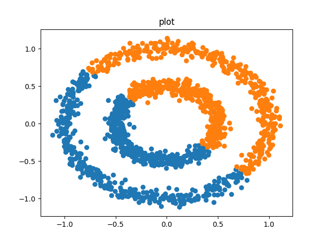
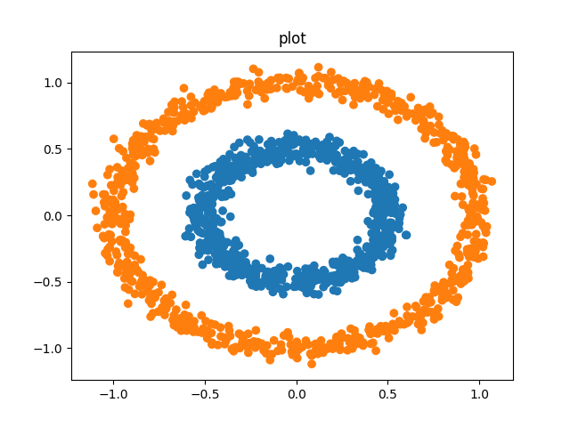

From python API
=================


Analyze Dataset
--------------------------------------------

Tha analysis is based on:

- Silhouette index:  The silhouette value is a measure of how similar an object is to its own cluster (cohesion) compared to other clusters (separation). Therefore, as high as possible the better.

- Calinski-Harabasz index: The score is defined as ratio between the within-cluster dispersion and the between-cluster dispersion.

- David-Bouldin index: The score refers to a model with better separation between the clusters.

::

  
  from sklearn import cluster, datasets, mixture
  import cluster_drug_discovery.methods.kmeans as ks

  X, y = datasets.make_blobs(n_samples=1500, random_state=170)
  cluster = ks.KmeansAlg(X, nclust=3)
  cluster.analyze() 


Silhouette
````````````````````
As seen in the pictures belowe as high the silhoutte coeficient 
is the better the clustering. As the silhoutte coefficient give us
a sense of how separate each point is from the other clusters.

Therefore, when we move from 3 to 4 clusters the silhouette index
of the first and second cluster clearly drops as they are next to each 
other in the feature space while with nclusters=3 all clusters were very
separated.

In case of having a 2D dataset the plot will be the values of the samples.
If the dataset is 3D or higher the plot will show the first two pca components.
However, we will retrieve umap plots to include non linear dimensionallity reduction
techniques. (Learn more three sections below)


.. figure:: images/silhouette_2.png
    :scale: 50%
    :align: center

.. figure:: images/silhouette_3.png
    :scale: 50%
    :align: center

.. figure:: images/silhouette_4.png
    :scale: 50%
    :align: center

Carlinski
``````````````````

In terms of the  Calinski-Harabasz index the score is higher when clusters are dense and well separated,
which relates to a standard concept of a cluster. The score is fast to compute.
Whereas, The Calinski-Harabasz index is generally higher for convex clusters than other concepts of clusters,
such as density based clusters like those obtained through DBSCAN.

As seen in the plot belowe as Calinski index is based only on density it gives a better 
score for ncluster=4 than ncluster=3 as the clusters are smaller and therefore more dense.
However, that does not mean that the result is better. In conclusion, this index give us usufull
information about the cluster density but must be use with other indexes like the silhoutte.


.. figure:: images/calinski_score.png
    :scale: 80%
    :align: center


David-Bouldin
```````````````````````

The David-Bouldin score refers to a model with better separation between the clusters since algorithms that produce clusters with low intra-cluster distances (high intra-cluster similarity) and high inter-cluster distances (low inter-cluster similarity) will have a low Davies–Bouldin index, the clustering algorithm that produces a collection of clusters with the smallest Davies–Bouldin index is considered the best algorithm based on this criterion.

As seen in the plot below we can clearly differenciate that moving from nclust=2 to nclust=3 the intra-cluster
distance gets better. However, from nclust=3 and nclust=4 the intra-cluster distance remains the same and the 
values does no change that much.


.. figure:: images/davidbouldin_score.png
    :scale: 80%
    :align: center

Umap Projection
``````````````````
Universal manifold dimensionallity reduction technique is a non linear transformation that tries
to keep the distance between similar datapoints while emphasizing these one between disimilar samples.
It is very useful when trying to visualize a high dimensionallity dataset where pca is discriminative enough.


.. figure:: images/umap_12.png
    :scale: 80%
    :align: center


Analysis Conclusion
`````````````````````

All indexes give useful information, then the most efficient anlysis
to set the clustering parameters would be to put the three of them
together with some visualization tool (dimensionallity reduction).


Clustering Algorithms
------------------------

Kmeans
````````

     - Advantages :
    
        -  If variables are huge, then  K-Means most of the times computationally faster than hierarchical clustering, if we keep k smalls.
    
        -  K-Means produce tighter clusters than hierarchical clustering, especially if the clusters are globular.
    
     - Disadvantages :
    
        - Difficult to predict K-Value.
        - With global cluster, it didn't work well.
        - Different initial partitions can result in different final clusters.
        - It does not work well with different size and density clusters


     Learn more: https://en.wikipedia.org/wiki/K-means_clustering

     ::

        from cluster_drug_discovery.methods import kmeans
        import matplotlib.pyplot as plt
        cluster = kmeans.KmeansAlg(X, nclust=3) 
        y_pred = cluster.run()
        plt.plot(X[:, 0], X[:, 1], y_pred)

Kmeans works for globular clusters:
    
.. figure:: images/kmeans_work.png
    :scale: 80%
    :align: center

But not for density-different o converx clusters:




DBSCAN
````````
    - Advantages of DBSCAN:
    
        - Is great at separating clusters of high density versus clusters of low density within a given dataset.
        - Is great with handling outliers within the dataset.
    
    - Disadvantages of DBSCAN:
    
        - Does not work well when dealing with clusters of varying densities. While DBSCAN is great at separating high density clusters from low density clusters, DBSCAN struggles with clusters of similar density.
        - Struggles with high dimensionality data. I know, this entire article I have stated how DBSCAN is great at contorting the data into different dimensions and shapes. However, DBSCAN can only go so far, if given data with too many dimensions, DBSCAN suffers
    
    
     Learn more: https://en.wikipedia.org/wiki/DBSCAN

     ::

        from cluster_drug_discovery.methods import dbscan
        cluster = dbscan.DbscanAlg(X, nclust=3) 
        y_pred = cluster.run()
        pl.plot(X[:, 0], X[:, 1], y_pred, output=str(i_dataset))

DBSCAN works for non globular clusters but suffers with high dimensionallity
    



Hierarchichal 
```````````````````````````````
    - Advantages
    
         - No apriori information about the number of clusters required.
        
         - Easy to implement and gives best result in some cases.
    
    
    - Disadvantages
    
         - Algorithm can never undo what was done previously.
         -
         - Time complexity of at least O(n2 log n) is required, where ‘n’ is the number of data points.
         -
         - Based on the type of distance matrix chosen for merging different algorithms can suffer with outliers & complexity   
     
     Learn more: https://en.wikipedia.org/wiki/Hierarchical_clustering

     ::

        from cluster_drug_discovery.methods import agglomerative
        cluster = agglomerative.AgglomerativeAlg(X, nclust=3) 
        y_pred = cluster.run()
        pl.plot(X[:, 0], X[:, 1], y_pred, output=str(i_dataset))

Agglomerative Clustering works for globular data but not convex datasets
    
.. figure:: images/agglomerative.png
    :scale: 80%
    :align: center


```````````````````````````````
    - Advantages
    
         - No apriori information about the number of clusters required.
        
         - Easy to implement and gives best result in some cases.
    
    
    - Disadvantages
    
         - Algorithm can never undo what was done previously.
         -
         - Time complexity of at least O(n2 log n) is required, where ‘n’ is the number of data points.
         -
         - Based on the type of distance matrix chosen for merging different algorithms can suffer with outliers & complexity   
     
     Learn more: https://en.wikipedia.org/wiki/Hierarchical_clustering

     ::

        from cluster_drug_discovery.methods import agglomerative
        cluster = agglomerative.AgglomerativeAlg(X, nclust=3) 
        y_pred = cluster.run()
        pl.plot(X[:, 0], X[:, 1], y_pred, output=str(i_dataset))

Agglomerative Clustering works for globular data but not convex datasets
    
.. figure:: images/agglomerative.png
    :scale: 80%
    :align: center

